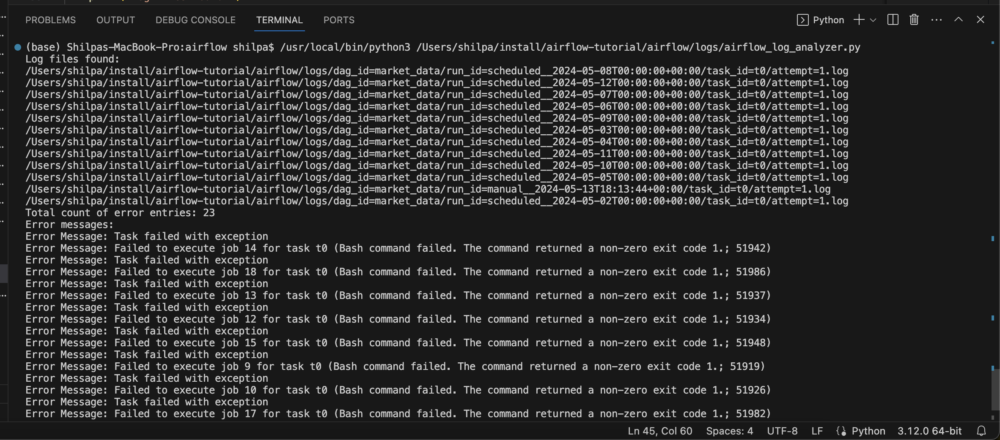

# Airflow Log Analyzer

## Project Description

This Airflow project extends the work done in a previous Airflow project ("Airflow_DAG_Schedulinh") involving the creation and scheduling of an Airflow Directed Acyclic Graph (DAG). After scheduling the DAG object in Airflow, it's crucial to regularly check the status of the various jobs in the data pipeline. One way to monitor the job status is to analyze the log messages generated from each run. The goal of this project is to develop a Python log analyzer to track the DAG airflow configuration from the previous one. The log analyzer shows the following information: the total count of error messages and a detailed message regarding each error.

## Learning Objectives

- Use text-processing techniques in Python to make sense of logs.
- Learn where airflow logs are located.
- Learn how to monitor automated airflow DAGs to ensure they are working properly.

## Steps Taken in the Python Script

The Python script `airflow_log_analyzer.py` consists of the following methods:

### Step 1: Iterate through the Root Directory and Get All Log Files

This step involves iterating through the root directory to retrieve all log files. Python's `pathlib` module is used to recursively list all files ending with the extension ".log".

### Step 2: Develop a Method to Parse Each Log File

In this step, a method named `analyze_file` is developed to parse each log file obtained in Step 1. This method extracts error messages from each log file and returns the total count of error messages along with detailed information about each error.

### Step 3: Print Cumulative Information from All Log Files

The script prints the cumulative information collected from all the log files located in the root directory. This includes the total count of error messages and detailed messages regarding each error.

## Execution Steps

Follow these steps to execute the code and confirm the outcome:

1. Clone the repository on your local machine.
2. Ensure you have a Python environment set up and the required dependencies installed.
3. Make sure you have a Visual Studio IDE or any other Python-compatible IDE to run the Python code.
4. Run the script `airflow_log_analyzer.py`. It should display the total count of error messages generated in the log files located in the root directory you have defined.

Note: Please ensure that you replace the placeholder with the absolute path of the airflow "logs" folder on your machine. If not, the output may throw an error.

## Execution Output

